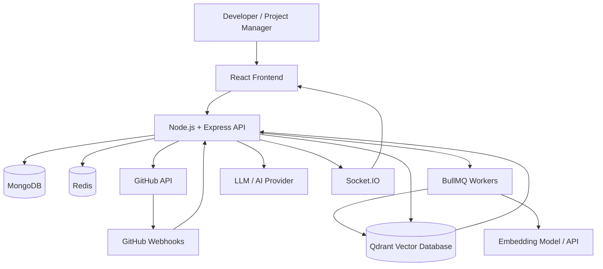
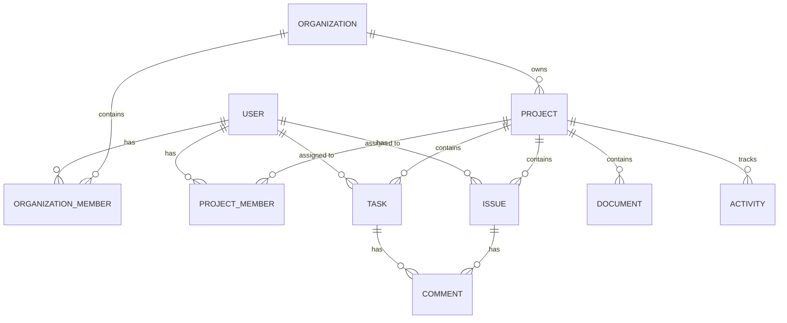

# AI-Powered Developer Collaboration & Project Management Platform

A developer-centric collaboration platform that brings project management, GitHub workflows, real-time collaboration, AI assistance, and project-specific knowledge retrieval into a single, unified workspace.

---

## Overview

Modern software development workflows are often highly fragmented. Developers and managers are typically forced to bounce between completely disparate tools for issue tracking, source control, team communication, and documentation. 

This platform solves that fragmentation by serving as a **Unified Developer Workspace**. It brings traditional agile project management methodologies together with deep GitHub integration and an intelligent, context-aware AI assistant. Instead of generic AI responses, the assistant utilizes **Retrieval-Augmented Generation (RAG)** to provide answers informed by your specific project's documentation, tasks, issues, and code repository activity.

---

## Key Features

### 🔐 Authentication & Access Control
- User registration and secure login
- JWT-based authentication
- Protected routing and API endpoints
- Role-based access control (RBAC)
- Organization membership validation

### 🏢 Organization Management
- Seamless organization creation
- Comprehensive member management
- Email-based team invitations
- Organization-level roles (Owner, Admin, Member)
- Project ownership partitioning

### 📋 Project Management
- Create and manage isolated project workspaces
- Assign project-specific roles (Project Manager, Developer)
- Full task and issue management lifecycles
- Kanban-style status workflows (TODO, IN PROGRESS, IN REVIEW, DONE)
- Graphical analytics and progress tracking (Recharts)
- Discussion comments on tasks and issues
- Granular activity audit trails

### 🔗 GitHub Integration
- GitHub OAuth application integration
- Connect and link specific GitHub repositories to internal projects
- Sync repository branch and commit information
- Track and display Pull Request events
- Map GitHub Issues directly to internal issues
- Two-way status synchronization powered by GitHub Webhooks

### ⚡ Real-Time Collaboration
- WebSockets powered by **Socket.IO**
- Real-time notification delivery
- Instant project activity updates (tasks created, issues updated, etc.)
- Live GitHub event synchronization across clients
- Asynchronous document processing status updates

### 🤖 AI Project Assistant
- Highly context-aware AI assistant utilizing project metadata
- Understands specific tasks and issues
- Aware of linked GitHub repository state
- Context-aware Q&A based on the current workspace
- Summarizes project progress intelligently

### 📚 RAG Knowledge Base
- Document management (Upload Project Documents)
- Backend text extraction and chunking pipeline
- Embedding generation for semantic meaning
- Vector storage using **Qdrant**
- Semantic retrieval mapping questions to project documents
- AI responses strictly backed by specific source references

### 🚀 Infrastructure
- High-performance caching with **Redis**
- **BullMQ** for robust background job processing (handling document embeddings & GitHub webhooks)
- Scalable backend architecture built with Express.js
- Modern frontend architecture built with Vite + React + Zustand

---

## Why This Project?

Traditional development ecosystems suffer from disconnected contexts. 

**The Old Workflow:**
Developer ➔ Project Management Tool ➔ GitHub ➔ Documentation Base ➔ Communication Platform ➔ External AI Tool

This results in a massive loss of productivity due to context switching. A generic AI chatbot cannot easily help you debug a task if it doesn't know the exact GitHub commits pushed to the branch, the specifications written in the project documents, or the comments left by the QA team on the issue ticket.

**The New Workflow:**
Developer ➔ **Single Project Workspace** ➔ (Tasks + Issues + GitHub + Documentation + AI)

By embedding an AI assistant directly inside a real-time, GitHub-connected project management tool, the AI can seamlessly ingest all relevant context. When you ask the AI for an update, it can analyze the latest PRs, cross-reference the uploaded architecture documents via Qdrant vector search, and summarize the exact status of the task you are currently viewing.

---

## System Architecture

---

## Database Models

The system architecture is supported by a robust NoSQL schema design in MongoDB. Below is a high-level Entity-Relationship representation of the core data models:

---

## Contributors

- **Ashish Gautam** - *Lead Developer / Architect*
